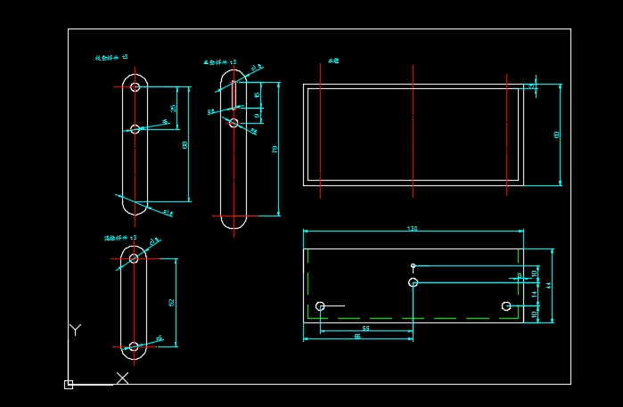
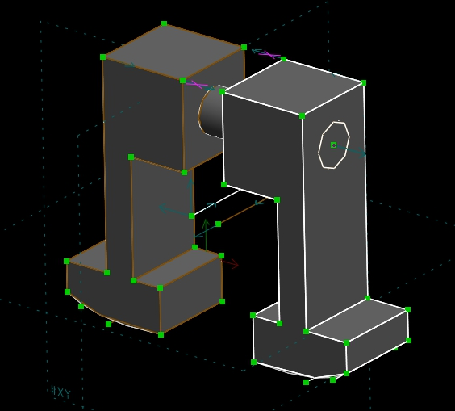

Title: 協同產品設計實習 第十七週作業
Date: 2017-06-15 12:08
Category:seat table
Tags:seat table
Author: 43

<b>期末前一周簡報
</b>

<!-- PELICAN_END_SUMMARY -->

##協同產品設計實習課程 第十七週

期末協同查驗與自評

行走機構零件繪製 零件一

<iframe width="560" height="315" src="https://www.youtube.com/embed/Xd3ETqg0lbg" frameborder="0" allowfullscreen></iframe>

行走機構零件繪製 零件二 零件三

<iframe width="560" height="315" src="https://www.youtube.com/embed/D_0RTTKm2x8" frameborder="0" allowfullscreen></iframe>

行走機構零件導入v-rep

<iframe src="https://player.vimeo.com/video/222862747" width="640" height="361" frameborder="0" webkitallowfullscreen mozallowfullscreen allowfullscreen></iframe> 
<a href="https://vimeo.com/222862747">國立虎尾科技大學 機械設計系 協同產品設計實習 40423143 楊智勝 第十七週 v-rep導入</a> from <a href="https://vimeo.com/user44207171">楊智勝</a> on <a href="https://vimeo.com">Vimeo</a>.

1.各組員倉儲中的 Github 檔案推送

40423143 Github 檔案推送過程
<iframe src="https://player.vimeo.com/video/222338006" width="640" height="361" frameborder="0" webkitallowfullscreen mozallowfullscreen allowfullscreen></iframe> 
<a href="https://vimeo.com/222338006">40423143-2017springcd-final-1.mp4</a> from <a href="https://vimeo.com/user44207171">楊智勝</a> on <a href="https://vimeo.com">Vimeo</a>.

2.各組員網誌上的 2D 繪圖, 並將程式碼顯示在繪圖網誌文章中

3.各組員倉儲中的子模組建立與運用, 並將程式碼顯示在繪圖網誌文章中

4.各組員 Solvespace 近端零組件繪圖, 並在各組員網誌中顯示指定的零組件

<iframe src="https://player.vimeo.com/video/223101243" width="640" height="361" frameborder="0" webkitallowfullscreen mozallowfullscreen allowfullscreen></iframe> 
<a href="https://vimeo.com/223101243">國立虎尾科技大學 機械設計系 協同產品設計實習 40423143 楊智勝 第十七週 solvespace組合過程</a> from <a href="https://vimeo.com/user44207171">楊智勝</a> on <a href="https://vimeo.com">Vimeo</a>.

5.各組員 Solvespace 零件轉入 V-rep, 並設定驅動零件進行動態模擬

6.各組員說明在分組行走機構模擬與實作過程中所扮演的角色, 並利用影片檔說明所負責完成的任務

7.各組以協同方式整合各組組員所完成的倉儲, 網誌與操作影片後, 以學號名稱當作子目錄, 其中放入各組員上述各題所完成的操作影片後, 上傳到各組在系上的 Fossil SCM 倉儲, 並設法用各組的 Github Pages 進行分組簡報.

#行走機構
##零件

<iframe src="./../data/w17/1.html"
width="800" height="600"></iframe>

<iframe src="./../data/w17/2.html"
width="800" height="600"></iframe>

<iframe src="./../data/w17/組合.html"
width="800" height="600"></iframe>

第七組行走機構:

<h2>設計理論CAD圖</h2>

<h2>組合圖</h2>

心得:繪製零件過程有組員說Solvespace程式難用,但其實多畫幾次就熟了
零件部分是簡單的,難的部分是協同

