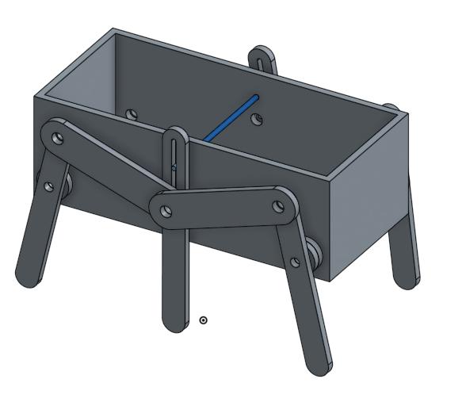
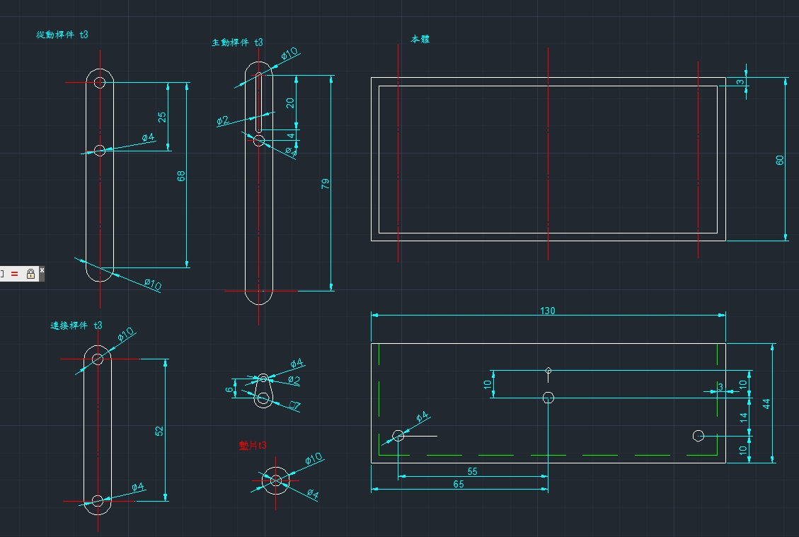

Title: 協同產品設計實習 第七組行走機構
Date: 2017-06-25 12:08
Category:seat table
Tags:seat table
Author: 43

<b>第七組行走機構
</b>

<!-- PELICAN_END_SUMMARY -->

##協同產品設計實習課程 第七組行走機構

我是第七組組長負責工作是 onshape上的零件組合,由其他組員繪製零件跟設計後進行組裝跟模擬 

工作分配:

40423143:onshape協同畫圖,組裝模擬,分配工作,錯誤回報,小組架構更新

40423114:結構設計,理論分析,錯誤回報

40423141:協同畫圖,錯誤回報

40423146:v-rep模擬,錯誤回報

40423120:實體列印

40423124:實體列印

##第七組網誌連結

<a href="https://40423143.github.io/2017springcd_ag7/blog/index.html">第七組網誌工作區</a>

#零件組裝1:組裝40423143

<iframe width="560" height="315" src="https://www.youtube.com/embed/78NNDtbeJr0" frameborder="0" allowfullscreen></iframe>

#零件組裝2:組裝40423143

<iframe width="560" height="315" src="https://www.youtube.com/embed/QmXKsrjlpj4" frameborder="0" allowfullscreen></iframe>

#零件組裝3:組裝40423143

<iframe width="560" height="315" src="https://www.youtube.com/embed/7JNL24P4rl4" frameborder="0" allowfullscreen></iframe>

#以下為組員影片:

#設計理論:40423114

<iframe width="560" height="315" src="https://www.youtube.com/embed/PTu03Rc3JFs" frameborder="0" allowfullscreen></iframe>

#設計理論模擬:40423114

<iframe width="560" height="315" src="https://www.youtube.com/embed/SE2vWjBshwE" frameborder="0" allowfullscreen></iframe>

#Autodesk繪製:40423114

<iframe width="560" height="315" src="https://www.youtube.com/embed/-dFZG04SMqg" frameborder="0" allowfullscreen></iframe>

#零件繪製:40423141

<iframe src="https://player.vimeo.com/video/222997294" width="640" height="307" frameborder="0" webkitallowfullscreen mozallowfullscreen allowfullscreen></iframe>

<a href="https://vimeo.com/222997294">52mm</a> from <a href="https://vimeo.com/user63666337">黃羿誠</a> on <a href="https://vimeo.com">Vimeo</a>.

#零件繪製:40423141

<iframe src="https://player.vimeo.com/video/222997298" width="640" height="307" frameborder="0" webkitallowfullscreen mozallowfullscreen allowfullscreen></iframe>

<a href="https://vimeo.com/222997298">68mm</a> from <a href="https://vimeo.com/user63666337">黃羿誠</a> on <a href="https://vimeo.com">Vimeo</a>.

#零件繪製:40423141

<iframe src="https://player.vimeo.com/video/222997306" width="640" height="307" frameborder="0" webkitallowfullscreen mozallowfullscreen allowfullscreen></iframe>

<a href="https://vimeo.com/222997306">79mm</a> from <a href="https://vimeo.com/user63666337">黃羿誠</a> on <a href="https://vimeo.com">Vimeo</a>.

#零件繪製:40423141

<iframe src="https://player.vimeo.com/video/222997311" width="640" height="307" frameborder="0" webkitallowfullscreen mozallowfullscreen allowfullscreen></iframe>

<a href="https://vimeo.com/222997311">本體</a> from <a href="https://vimeo.com/user63666337">黃羿誠</a> on <a href="https://vimeo.com">Vimeo</a>.

 </h2>onshape工作區</h2>
 
  <a href="https://cad.onshape.com/documents/274005be1e8241d3c766f9f1/w/964eb62a09323c7d3b75db99/e/5634f93660a4e4f43a6c08e6">https://cad.onshape.com/documents/274005be1e8241d3c766f9f1/w/964eb62a09323c7d3b75db99/e/5634f93660a4e4f43a6c08e6</a>

<h2>等角視圖</h2>

<h2>設計理論CAD圖</h2>

<h2>設計理論CAD圖檔下載</h2>

<h2>CAD圖檔下載區</h2>

<a href="./../data/w19/W19-1.dwg">CAD圖檔下載區</a> (請以滑鼠右鍵存檔)

<h2>CAD圖檔下載區</h2>

<a href="./../data/w19/W19-2.dwg">CAD圖檔下載區</a> (請以滑鼠右鍵存檔)

<h2>行走機構下載區</h2>

<a href="./../data/w19/第七組行走機構.stl">第七組行走機構</a> (請以滑鼠右鍵存檔)

<a href="./../data/w19/本體.stl">本體
</a> (請以滑鼠右鍵存檔)

<a href="./../data/w19/79mm.stl">79mm主動桿
</a> (請以滑鼠右鍵存檔)

<a href="./../data/w19/68mm.stl">68mm從動桿
</a> (請以滑鼠右鍵存檔)

<a href="./../data/w19/52mm.stl">52mm連接桿
</a> (請以滑鼠右鍵存檔)

<a href="./../data/w19/墊片.stl">墊片
</a> (請以滑鼠右鍵存檔)

<h2>V-REP模擬</h2>

V-REP模擬由40423146負責

<iframe width="560" height="315" src="https://www.youtube.com/embed/CwhQCBxiv4A" frameborder="0" allowfullscreen></iframe>

<iframe width="560" height="315" src="https://www.youtube.com/embed/sVeLLyMRDws" frameborder="0" allowfullscreen></iframe>

<h2>實體切削過程</h2>

實體切削由40423120負責:

<iframe width="560" height="315" src="https://www.youtube.com/embed/73sQ9yvbqIA" frameborder="0" allowfullscreen></iframe>

實體切削由40423124負責:

<iframe width="560" height="315" src="https://www.youtube.com/embed/BHCHLwts0h4" frameborder="0" allowfullscreen></iframe>

##期末總結心得影片

<iframe width="560" height="315" src="https://www.youtube.com/embed/Syuhq2T-xQw" frameborder="0" allowfullscreen></iframe>

期末總結心得:修課心得:這半學期除了自己畫了這些零件外,還教會組員如何推資料跟畫零件,每天都應該要排進度,然後接受新的挑戰跟難關,可能還沒辦法做到最好,但至少我們正在努力

