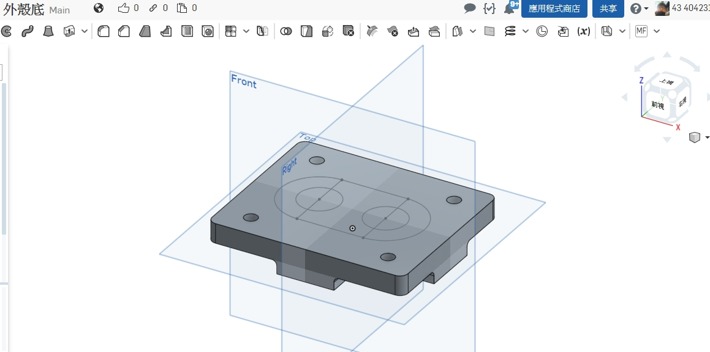
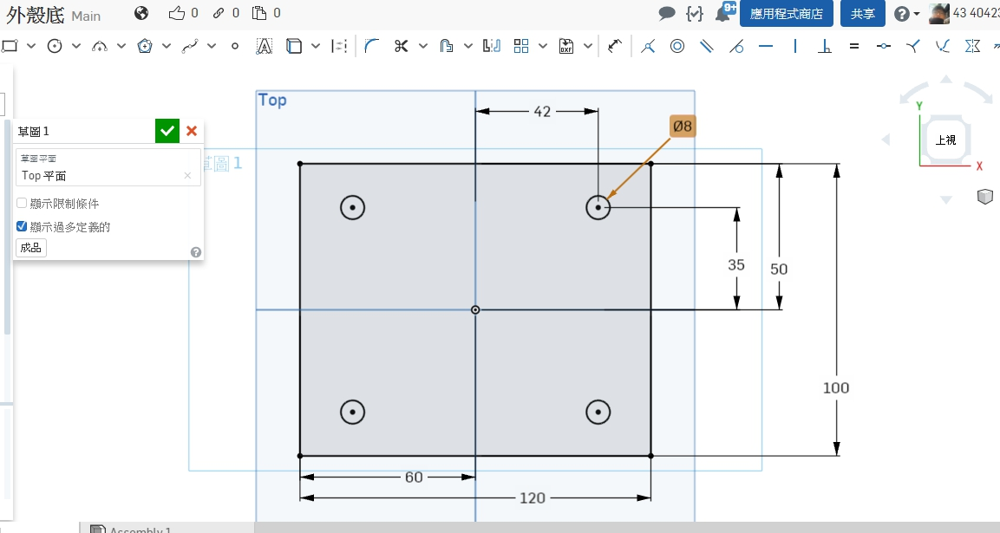
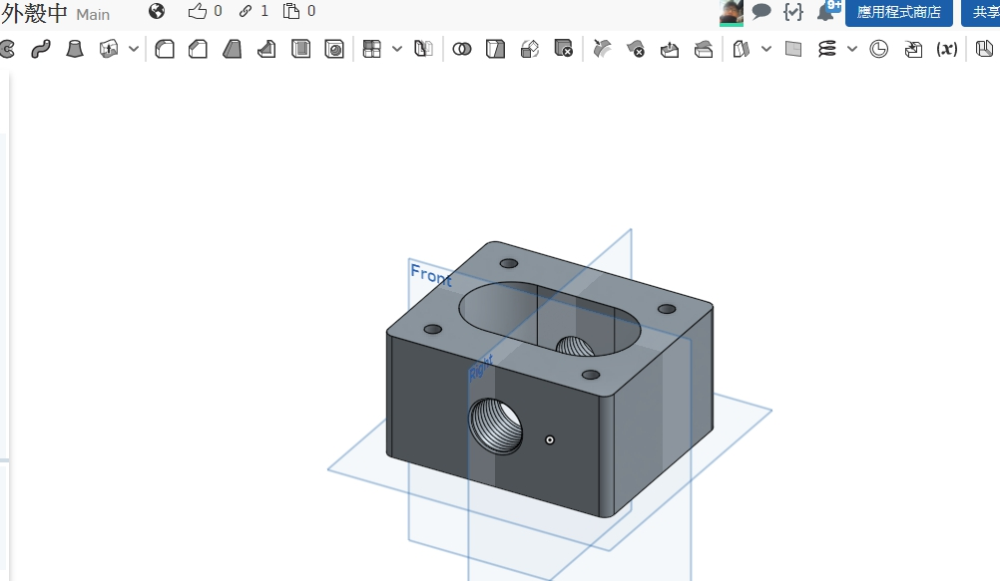
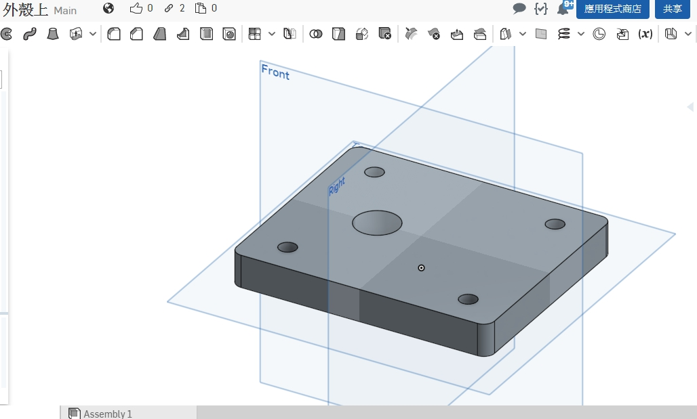
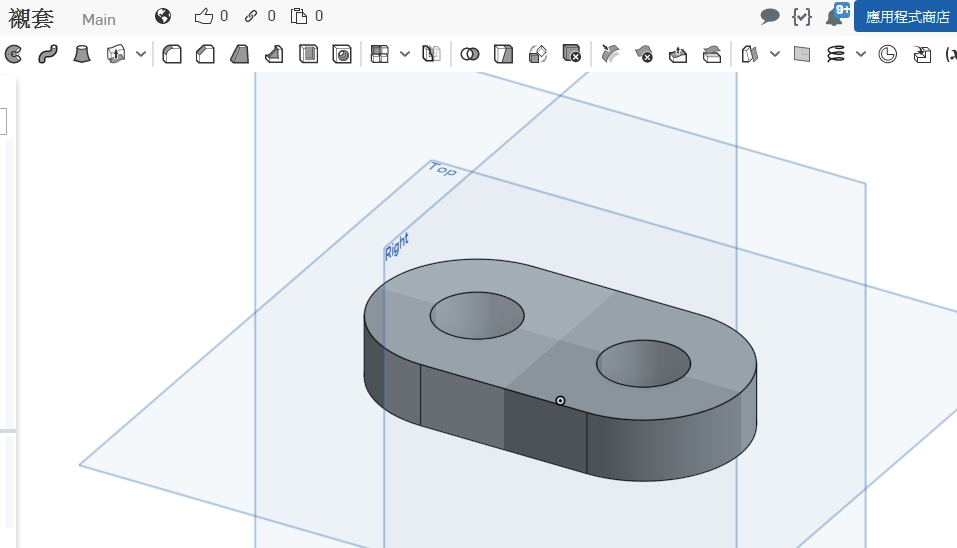
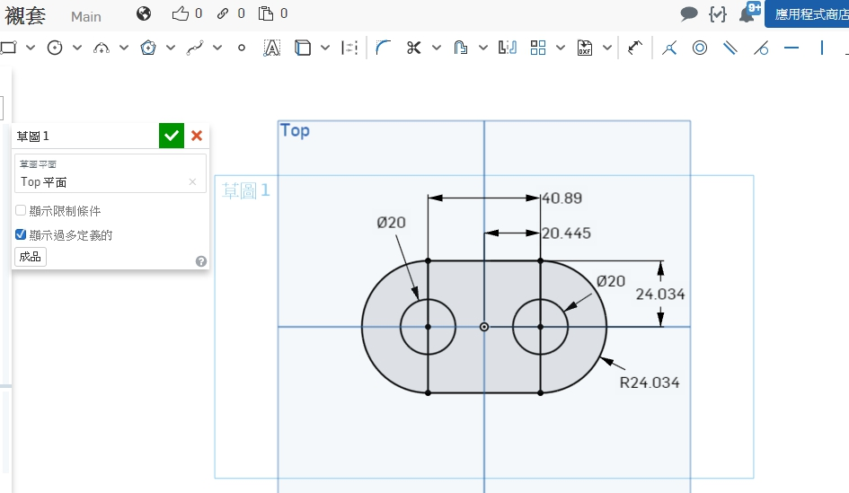
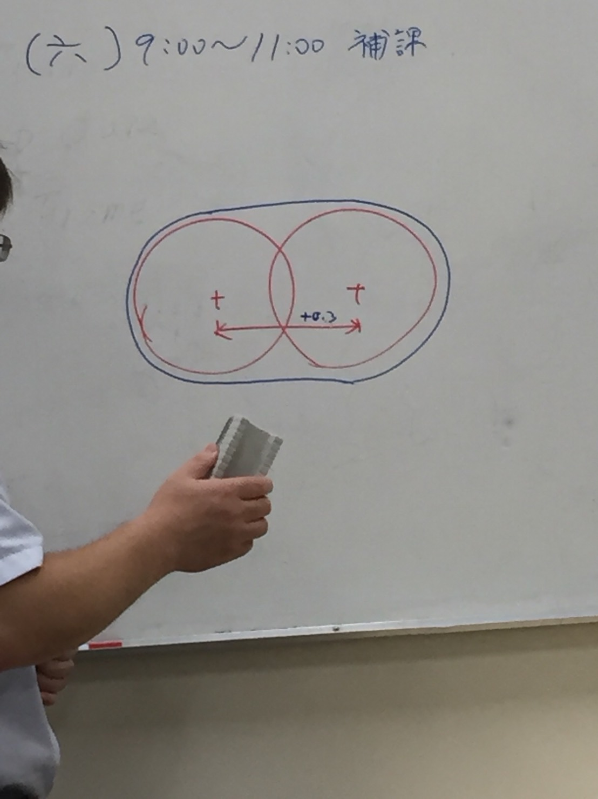

Title: 虎尾科技大學 專題報告 3D螺旋齒輪
Date: 2017-12-01 15:30
Category:seat table
Tags:seat table
Author: 楊智勝

<b>專題日誌
</b>

<!-- PELICAN_END_SUMMARY -->

專題 3D列印螺旋齒輪泵浦

#目前進度:

#底座等角圖

#底座設計圖

#底座實體連結檢視:

<a href="https://cad.onshape.com/documents/e513a48180a139662a63985d/w/2b244aa9aedc844860b4884d/e/9e1fd8f5c70d89c4f8bbf01f">底座連結</a>

#本體等角圖

#本體連結檢視:

<a href="https://cad.onshape.com/documents/e513a48180a139662a63985d/w/2b244aa9aedc844860b4884d/e/9e1fd8f5c70d89c4f8bbf01f">本體連結</a>

#上蓋等角圖

#上蓋實體連結檢視:

<a href="https://cad.onshape.com/documents/e02d77fdbf3e601fb4772dd1/w/6fd4b37a50b3ed76b7cec948/e/8dbb3c2feb6920935f91960f">上蓋連結</a>

#襯套等角圖

#襯套設計圖

#實體連結檢視:

<a href="https://cad.onshape.com/documents/23e32e64c1b02fe13202df41/w/426f84884f95822b0712e9a0/e/8ab22bc45fecca3b4998f508">襯套</a>

左旋齒輪:

右旋齒輪:

襯套加大0.5mm中心距加大0.3mm

下禮拜會初印

